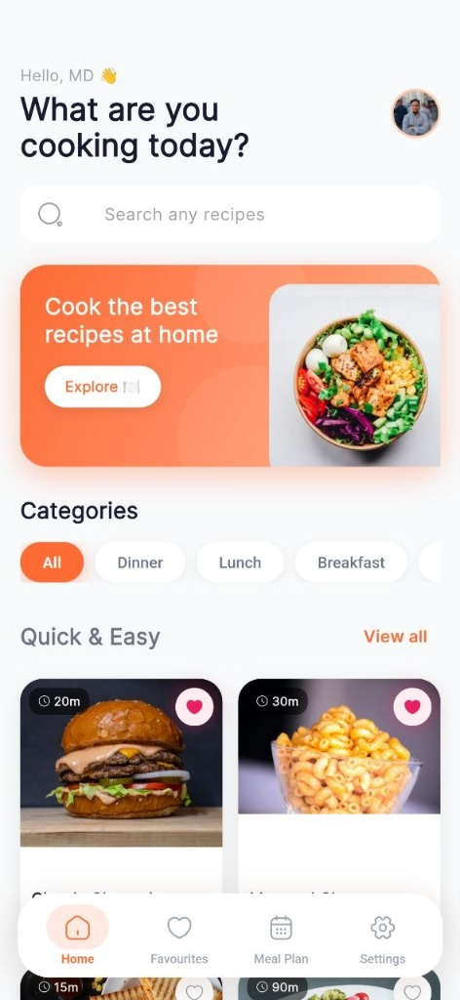
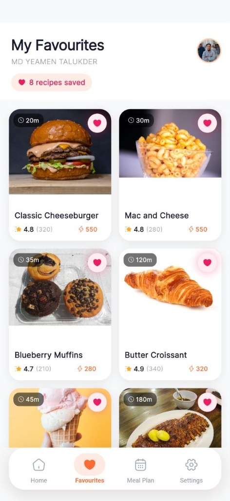
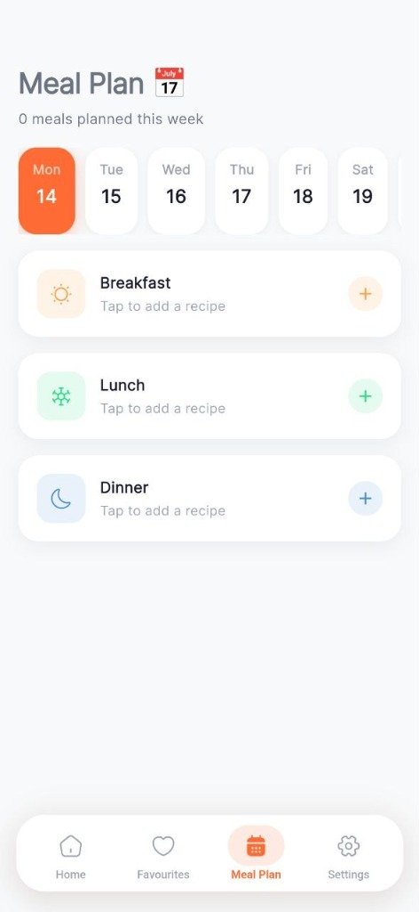
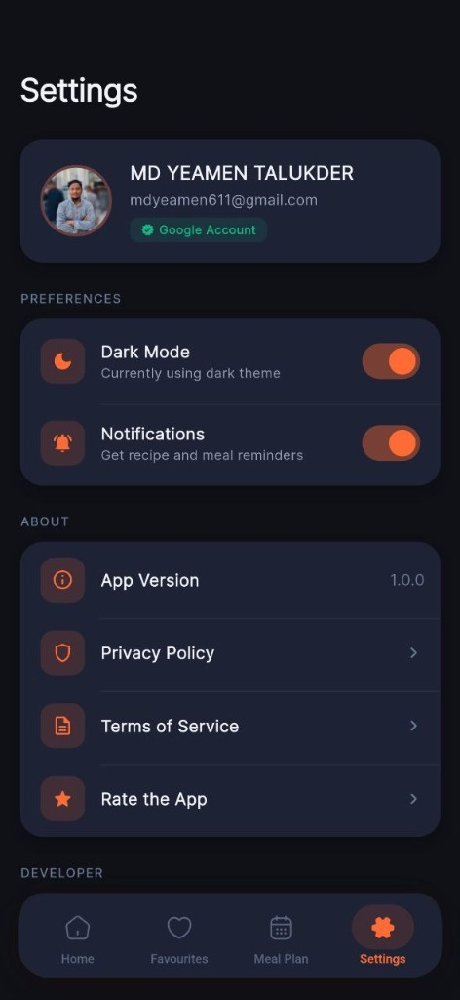
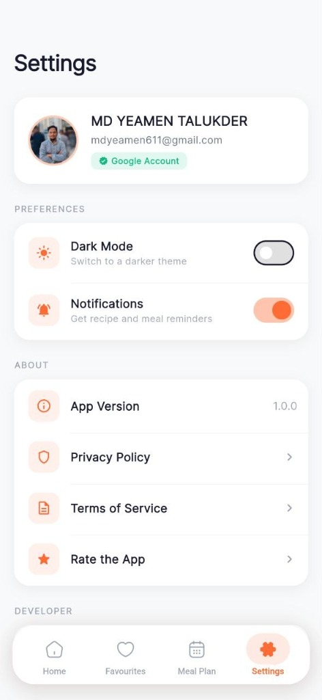

<div align="center">

  

  # 🍽️ Recipe App

  <p align="center">
    <strong>A next-generation culinary companion built with Flutter, Provider &amp; Firebase.</strong><br/>
    Smart meal planning · Real-time cloud sync · Lightning-fast discovery · Distraction-free cooking mode · Community reviews
  </p>

  <!-- Nav Links -->
  <p align="center">
    <a href="#-app-showcase">Showcase</a> •
    <a href="#-features">Features</a> •
    <a href="#-design-system">Design System</a> •
    <a href="#-tech-stack">Tech Stack</a> •
    <a href="#-architecture">Architecture</a> •
    <a href="#-getting-started">Getting Started</a> •
    <a href="#-download-apk">Download APK</a>
  </p>

  <!-- Tech Badges -->
  <p align="center">
    
    
    
    
  </p>

  <!-- Status & Stats Badges -->
  <p align="center">
    <a href="https://github.com/Yeamin-Talukder/Recipe-App/releases/latest">
      
    </a>
    <a href="https://github.com/Yeamin-Talukder/Recipe-App/releases">
      
    </a>
    
    
    
    
    
  </p>

  <br/>

  <!-- Download CTA -->
  <a href="https://github.com/Yeamin-Talukder/Recipe-App/releases/latest">
    
  </a>

</div>

---

## 📱 App Showcase

<div align="center">
  <video src="https://github.com/Yeamin-Talukder/Recipe-App/raw/main/screen%20record.mp4" width="280" controls autoplay loop muted></video>
  <br/><br/>
  
  <table>
    <thead>
      <tr>
        <th align="center">🏠 Home &amp; Explore</th>
        <th align="center">❤️ Saved Favourites</th>
        <th align="center">📅 Smart Meal Planner</th>
      </tr>
    </thead>
    <tbody>
      <tr>
        <td align="center">
          
        </td>
        <td align="center">
          
        </td>
        <td align="center">
          
        </td>
      </tr>
      <tr>
        <td align="center"><b>Smart Search &amp; Categories</b></td>
        <td align="center"><b>Instant Cloud-Synced Recipes</b></td>
        <td align="center"><b>Weekly Breakfast, Lunch &amp; Dinner</b></td>
      </tr>
    </tbody>
  </table>

  <br/>

  <table>
    <thead>
      <tr>
        <th align="center">🌙 Dark Theme</th>
        <th align="center">☀️ Light Theme</th>
      </tr>
    </thead>
    <tbody>
      <tr>
        <td align="center">
          
        </td>
        <td align="center">
          
        </td>
      </tr>
      <tr>
        <td align="center"><b>Warm Charcoal &amp; Coral Accents</b></td>
        <td align="center"><b>Warm Ivory &amp; Minimalist</b></td>
      </tr>
    </tbody>
  </table>
</div>


---

## ✨ Features

| # | Feature | Description |
|---|---|---|
| 🎨 | **Adaptive Dark & Light Theme** | Toggle between a warm charcoal dark theme with coral-orange accents and a crisp warm ivory light theme |
| 🔍 | **Instant Recipe Discovery** | Browse by category — Breakfast, Lunch, Dinner, Desserts — with real-time search filtering |
| 📅 | **Interactive Meal Planner** | Schedule meals Mon–Sun across Breakfast, Lunch & Dinner slots with serving counters |
| ⭐ | **Community Reviews** | Write, edit & delete star-rated reviews per recipe, with live rating aggregation |
| ☁️ | **Cloud Sync & Google Auth** | One-tap Google Sign-In keeps favourites & meal plans synced across devices via Firestore |
| 👤 | **Guest Mode** | Explore all recipes instantly — no forced sign-up, contextual prompts only where needed |
| 🍳 | **Distraction-Free Cooking Mode** | Step-by-step cooking view with screen-always-on to prevent lock during cooking |
| 🔗 | **URL Launcher Integration** | Tap links within recipes to open external sources directly in the browser |
| ⚡ | **Performance & Image Caching** | Smooth 60/120 FPS scrolling with `cached_network_image` and optimised Provider state |
| 📦 | **Split ABI Builds** | Small, architecture-optimised APKs (`arm64-v8a`, `armeabi-v7a`) for broad device support |

---

## 🎨 Design System

The app uses a carefully crafted **warm, food-appropriate** colour palette — not a generic tech UI:

| Role | Token | Hex | Usage |
|---|---|---|---|
| 🟠 Primary | Warm Coral-Orange | `#E8623A` | Buttons, hero banners, primary CTAs |
| 🟡 Gradient | Warm Amber Gold | `#F5A623` | Banner gradient, warm highlights & warnings |
| 🟤 Dark BG | Warm Charcoal | `#1A1410` | Dark mode page background |
| 🟫 Dark Card | Rich Warm Charcoal | `#2D2621` | Dark mode cards & elevated surfaces |
| 🟢 Success | Fresh Green | `#2ECC71` | Healthy tags, success indicators |
| ⭐ Star | Golden Yellow | `#FFBE3D` | Star ratings display |
| 💗 Favourite | Hot Pink | `#E84393` | Save / favourite / love button |
| 🟡 Light BG | Warm Ivory | `#FAF8F5` | Light mode page background |

> **Typography:** Google Fonts — **Inter** is used throughout for a clean, modern reading experience.

---

## 🏗️ Architecture

Built following clean architecture principles with **Provider** for reactive state management:

```text
lib/
├── core/                        # Design system: tokens, colours, themes
│   ├── constants.dart           # Global colours, spacing & radius tokens
│   └── theme.dart               # Dark & Light ThemeData configurations
│
├── models/                      # Strongly-typed data models
│   ├── recipe.dart              # Recipe — macros, ingredients, instructions
│   ├── review.dart              # Review — star rating, comment, user info
│   ├── category_model.dart      # Recipe category entity
│   └── user_model.dart          # Firebase user entity
│
├── providers/                   # Reactive state (ChangeNotifier)
│   ├── auth_provider.dart       # User session & Google authentication state
│   ├── recipe_provider.dart     # Search, filter, recipe list state
│   ├── favorite_provider.dart   # Bookmarks & favourites state
│   ├── review_provider.dart     # Real-time review stream & submission
│   ├── meal_plan_provider.dart  # Weekly scheduling logic & counters
│   └── settings_provider.dart  # Theme persistence & toggle
│
├── repositories/                # Abstracted data access layer
│   ├── recipe_repository.dart   # Local & remote recipe sources + Firestore seeding
│   ├── review_repository.dart   # Atomic review CRUD with rating aggregation
│   └── user_repository.dart     # Firestore sync & user document management
│
├── services/                    # Third-party integrations
│   ├── auth_service.dart        # FirebaseAuth & GoogleSignIn
│   └── firestore_service.dart   # Firestore CRUD, transactions & streams
│
├── utils/                       # Shared utility helpers & extensions
│
└── ui/                          # Presentation layer
    ├── screens/                 # Full-page views
    │   ├── main_screen.dart             # Root shell with bottom navigation
    │   ├── home_screen.dart             # Recipe discovery & search
    │   ├── recipe_details_screen.dart   # Full recipe + review section
    │   ├── favorite_screen.dart         # Saved/bookmarked recipes
    │   ├── meal_plan_screen.dart        # Weekly meal planner
    │   ├── cooking_mode_screen.dart     # Distraction-free step view
    │   ├── login_screen.dart            # Google Sign-In / Guest entry
    │   └── settings_screen.dart        # Theme toggle & account management
    └── widgets/                 # Modular, reusable components
        ├── recipe_card.dart                   # Recipe grid/list card
        ├── review_section.dart                # Rating bar + review list
        ├── review_card.dart                   # Individual review card
        ├── review_input_sheet.dart            # Animated star picker + comment sheet
        ├── banner_to_explore.dart             # Hero explore banner
        ├── category_selector.dart             # Horizontal category filter chips
        ├── home_app_bar.dart                  # Custom home app bar
        ├── my_search_bar.dart                 # Search input widget
        ├── section_header.dart                # Section title row
        └── quantity_increment_decrement.dart  # Serving counter control
```

---

## 🛠️ Tech Stack

| Category | Technology | Version | Notes |
|---|---|---|---|
| **Framework** | [Flutter](https://flutter.dev/) | `^3.x` | Cross-platform UI toolkit |
| **Language** | [Dart](https://dart.dev/) | `^3.11.1` | Null-safe, strongly typed |
| **State** | [Provider](https://pub.dev/packages/provider) | `^6.1.5` | Decoupled reactive state & DI |
| **Database** | [Cloud Firestore](https://firebase.google.com/products/firestore) | `^6.9.0` | Real-time NoSQL, atomic transactions |
| **Auth** | [Firebase Auth](https://firebase.google.com/products/auth) | `^6.6.1` | Secure Firebase authentication |
| **Sign-In** | [Google Sign-In](https://pub.dev/packages/google_sign_in) | `^6.2.2` | OAuth2 SSO |
| **Typography** | [Google Fonts — Inter](https://fonts.google.com/specimen/Inter) | `^6.2.1` | Clean modern type hierarchy |
| **Icons** | [Iconsax](https://pub.dev/packages/iconsax) | `^0.0.8` | Polished outline icon set |
| **Image Cache** | [CachedNetworkImage](https://pub.dev/packages/cached_network_image) | `^3.4.1` | Efficient async image loading |
| **URL Launcher** | [url_launcher](https://pub.dev/packages/url_launcher) | `^6.3.1` | Open external URLs from within the app |
| **Date Formatting** | [intl](https://pub.dev/packages/intl) | `^0.20.3` | Locale-aware review date display |
| **Preferences** | [SharedPreferences](https://pub.dev/packages/shared_preferences) | `^2.5.3` | Theme & settings persistence |
| **App Icons** | [flutter_launcher_icons](https://pub.dev/packages/flutter_launcher_icons) | `^0.14.1` | Adaptive icon generation |

---

## 🚀 Getting Started

### Prerequisites

- [Flutter SDK](https://docs.flutter.dev/get-started/install) `^3.x`
- [Android Studio](https://developer.android.com/studio) or [VS Code](https://code.visualstudio.com/) with Flutter & Dart extensions
- An active [Firebase](https://console.firebase.google.com/) project with Firestore & Authentication enabled
- [Git](https://git-scm.com/) installed

### 1. Clone & Install

```bash
git clone https://github.com/Yeamin-Talukder/Recipe-App.git
cd Recipe-App
flutter pub get
```

### 2. Firebase Configuration

```bash
# Install the FlutterFire CLI
dart pub global activate flutterfire_cli

# Link to your Firebase project (generates firebase_options.dart)
flutterfire configure
```

Then enable the following in the [Firebase Console](https://console.firebase.google.com/):

- ✅ **Authentication** → Enable the **Google** sign-in provider
- ✅ **Cloud Firestore** → Create a database (with appropriate security rules)

### 3. Run the App

```bash
# Hot-reload development build
flutter run

# Optimised release APK — split by ABI (smaller file sizes)
flutter build apk --split-per-abi

# Universal APK (larger, supports all architectures)
flutter build apk
```

### 4. Generate App Icons *(optional)*

```bash
dart run flutter_launcher_icons
```

---

## 📦 Download APK

<div align="center">

| Build | Architecture | Best For |
|---|---|---|
| `app-arm64-v8a-release.apk` | 64-bit ARM | All modern Android phones (recommended) |
| `app-armeabi-v7a-release.apk` | 32-bit ARM | Older Android devices |

<a href="https://github.com/Yeamin-Talukder/Recipe-App/releases/latest">
  
</a>

<br/>


</div>

---

## 🤝 Contributing

Contributions are what make the open-source community such an amazing place to learn and grow. Any contributions are **greatly appreciated**!

1. **Fork** the project
2. **Create** your feature branch → `git checkout -b feature/AmazingFeature`
3. **Commit** your changes → `git commit -m 'feat: add AmazingFeature'`
4. **Push** to the branch → `git push origin feature/AmazingFeature`
5. **Open a Pull Request** and describe your changes 🎉

> Please ensure your code follows the existing style and that `flutter analyze` passes with no issues before submitting.

---

## 👨‍💻 Author

**MD Yeamen Talukder**

<p>
  <a href="https://github.com/Yeamin-Talukder">
    
  </a>
  <a href="mailto:mdyeamen611@gmail.com">
    
  </a>
</p>

---

## 📄 License

This project is licensed under the **MIT License** — see the [LICENSE](LICENSE) file for details.

<div align="center">
  <br/>
  
  &nbsp;
  
  <br/><br/>
  <sub>Crafted with ❤️, ☕ and Flutter by MD Yeamen Talukder</sub>
</div>
